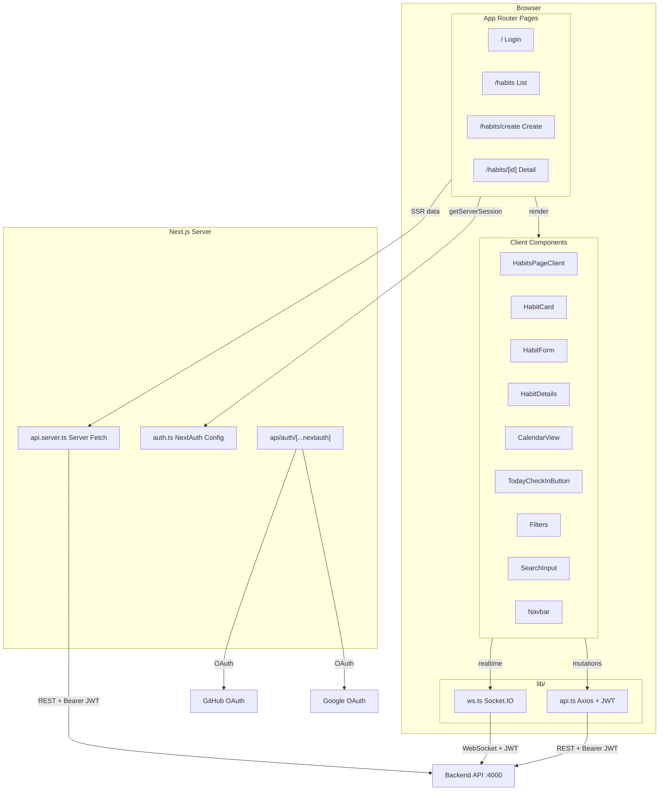
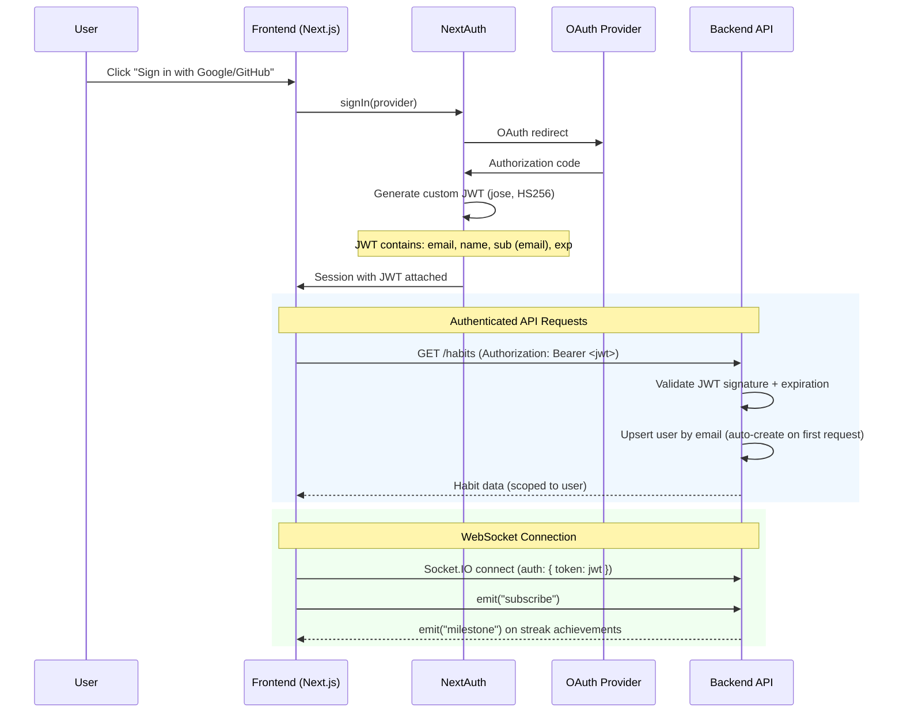
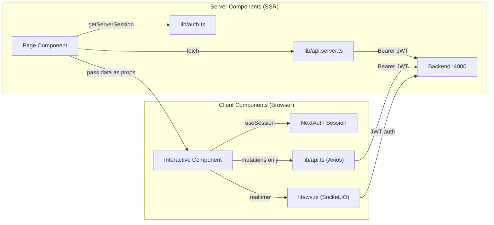

# Habit Tracker — Frontend

Next.js application providing the UI and authentication layer for the Habit Tracker with Streaks.

## Tech Stack

| Technology       | Version | Purpose                                         |
| ---------------- | ------- | ----------------------------------------------- |
| Next.js          | 16      | App Router, Server Components, Turbopack        |
| React            | 19      | UI rendering, Server/Client Components          |
| TypeScript       | 6       | Strict mode, type safety                        |
| NextAuth.js      | 4       | Google + GitHub SSO, JWT sessions               |
| Tailwind CSS     | 4       | Utility-first styling (`@import "tailwindcss"`) |
| ShadCN UI        | latest  | Pre-built accessible components (Radix-based)   |
| Axios            | 1.7     | Client-side HTTP (mutations only)               |
| Socket.IO Client | 4       | Real-time milestone notifications               |
| Zustand          | 4       | Lightweight state management                    |
| Lucide React     | 1       | Icon library                                    |

## Architecture



## Authentication Flow



### How JWT flows through the app

1. **Sign-in** -- User authenticates via Google or GitHub OAuth
2. **JWT creation** -- NextAuth `jwt` callback generates a signed JWT using `jose` (HS256, secret from `JWT_SECRET`)
3. **Session attachment** -- NextAuth `session` callback attaches the JWT to `session.user.jwt`
4. **Server Components** -- Access JWT via `getServerSession(authOptions)`, pass to `lib/api.server.ts` for SSR fetches
5. **Client Components** -- Access JWT via `useSession()`, Axios interceptor in `lib/api.ts` auto-attaches `Authorization: Bearer <jwt>`
6. **WebSocket** -- Socket.IO client sends JWT in `auth.token` during handshake

## Data Fetching Strategy



| Concern                            | Where            | How                                           |
| ---------------------------------- | ---------------- | --------------------------------------------- |
| Initial page data                  | Server Component | `lib/api.server.ts` with `getServerSession()` |
| Mutations (create, update, delete) | Client Component | `lib/api.ts` (Axios) with `useSession()`      |
| Real-time notifications            | Client Component | `lib/ws.ts` (Socket.IO)                       |
| Re-fetch after mutation            | Client Component | `router.refresh()` triggers server re-render  |

## Pages & Routes

| Route               | Component               | Auth      | Description                                                            |
| ------------------- | ----------------------- | --------- | ---------------------------------------------------------------------- |
| `/`                 | `LoginPage`             | Public    | Google/GitHub sign-in buttons; redirects to `/habits` if authenticated |
| `/habits`           | `HabitsPageClient`      | Protected | Habit list with search, filters (All/Active/Paused/Archived)           |
| `/habits/create`    | `CreateHabitPageClient` | Protected | Create habit form (name, description, start date)                      |
| `/habits/[id]`      | `HabitDetails`          | Protected | Habit detail with calendar view, check-in button, streak stats         |
| `/habits/[id]/edit` | `EditHabitPageClient`   | Protected | Edit habit form                                                        |

Protected routes check `getServerSession(authOptions)` server-side and redirect to `/` if unauthenticated.

## Project Structure

```
frontend/
  app/
    page.tsx                         # Login page
    layout.tsx                       # Root layout (Providers + Navbar)
    globals.css                      # Tailwind v4 styles
    habits/
      page.tsx                       # Habit list (server component)
      loading.tsx                    # Skeleton loader
      create/page.tsx                # Create habit
      [id]/
        page.tsx                     # Habit detail (server component)
        loading.tsx                  # Skeleton loader
        error.tsx                    # Error boundary
        edit/
          page.tsx                   # Edit habit (server component)
          loading.tsx                # Skeleton loader
    api/auth/[...nextauth]/route.ts  # NextAuth handler
  components/
    index.ts                         # Barrel exports
    Providers.tsx                    # SessionProvider wrapper
    Navbar/Navbar.tsx                # Top navigation
    HabitCard/HabitCard.tsx          # Habit card in list
    HabitList/HabitList.tsx          # Grid of habit cards
    HabitForm/HabitForm.tsx          # Create/edit form
    EditHabitForm/EditHabitForm.tsx  # Edit-specific form
    EditHabitPageClient/EditHabitPageClient.tsx  # Edit page client component
    HabitDetails/HabitDetails.tsx    # Detail view
    HabitDetails/TodayCheckInButton.tsx
    CalendarView/CalendarView.tsx    # Monthly check-in calendar
    ErrorBoundary/ErrorBoundary.tsx  # Reusable error boundary
    NotificationToaster/NotificationToaster.tsx  # Milestone toast notifications
    Filters/Filters.tsx             # Status filter buttons
    SearchInput/SearchInput.tsx     # Search input
    ui/                             # ShadCN components (auto-managed)
  hooks/
    index.ts                         # Barrel exports
    useHabits.ts                    # Habits data + refetch
    useHabitTracker.ts              # Habit tracker state management
    useWebsocket.ts                 # Socket.IO + milestone events
  lib/
    index.ts                         # Barrel exports (client-safe only)
    api.ts                          # Axios client (mutations)
    api.server.ts                   # Server-side fetch (SSR)
    auth.ts                         # NextAuth config (DO NOT MODIFY)
    ws.ts                           # Socket.IO factory
    utils.ts                        # cn() utility
  types/
    next-auth.d.ts                  # Session/JWT type augmentation
    calendar.ts                     # Weekday enum
```

## Environment Variables

Create `.env.local` in the `frontend/` directory:

```env
# NextAuth
NEXTAUTH_SECRET=your-nextauth-secret
NEXTAUTH_URL=http://localhost:3000

# OAuth Providers
GOOGLE_CLIENT_ID=your-google-client-id
GOOGLE_CLIENT_SECRET=your-google-client-secret
GITHUB_CLIENT_ID=your-github-client-id
GITHUB_CLIENT_SECRET=your-github-client-secret

# JWT (must match backend)
JWT_SECRET=your-jwt-secret
JWT_EXPIRES_IN=1d

# Backend API (server-side only)
BACKEND_API_URL=http://localhost:4000/api

# Backend API (client-side, NEXT_PUBLIC_ prefix required)
NEXT_PUBLIC_API_URL=http://localhost:4000/api

# WebSocket (client-side, NEXT_PUBLIC_ prefix required)
NEXT_PUBLIC_WS_URL=ws://localhost:4000/notifications
```

> **Important:** `JWT_SECRET` must be the **same value** in both `frontend/.env.local` and `backend/.env`.
> The frontend signs a JWT with this secret after OAuth login; the backend verifies it on every request.
> `NEXTAUTH_SECRET` is separate — it is only used internally by NextAuth to encrypt its own session cookie.

> **Note:** Only `NEXT_PUBLIC_*` variables are accessible in client components. All others are server-side only.

## Getting Started

### Prerequisites

- Node.js 20+
- Yarn 1.22+
- PostgreSQL 14+ (running locally or via Docker)
- Google and/or GitHub OAuth app credentials
- Backend API running on port 4000

### Installation

```bash
# From monorepo root (installs all workspaces)
yarn install

# Start the frontend
yarn dev:frontend
```

Or directly:

```bash
cd frontend
yarn dev
```

The app runs at [http://localhost:3000](http://localhost:3000).

### Full Local Development Workflow

```bash
# 1. Start PostgreSQL (if using Docker)
docker run -d --name habitdb -p 5432:5432 \
  -e POSTGRES_USER=user -e POSTGRES_PASSWORD=password \
  -e POSTGRES_DB=habittracker postgres:14

# 2. Set up environment files
cp frontend/.env.example frontend/.env.local
cp backend/.env.example backend/.env

# 3. Install dependencies
yarn install

# 4. Run database migrations
yarn workspace @habit/backend prisma migrate dev

# 5. Start backend (port 4000)
yarn dev:backend

# 6. Start frontend (port 3000)
yarn dev:frontend
```

Then open [http://localhost:3000](http://localhost:3000) and sign in with Google or GitHub.

## Scripts

| Command       | Description                               |
| ------------- | ----------------------------------------- |
| `yarn dev`    | Start dev server on port 3000 (Turbopack) |
| `yarn build`  | Production build                          |
| `yarn start`  | Start production server                   |
| `yarn lint`   | Run ESLint                                |
| `yarn format` | Run Prettier                              |
| `yarn test`   | Run tests                                 |

## Shared Package

The frontend imports types, DTOs, and utilities from `@habit/shared`:

```ts
import { Habit, CheckIn, HabitStatus } from '@habit/shared';
import { isToday, toISODate } from '@habit/shared';
```

Path alias `@habit/shared` is configured in `tsconfig.json` and `next.config.ts` (`transpilePackages`).
